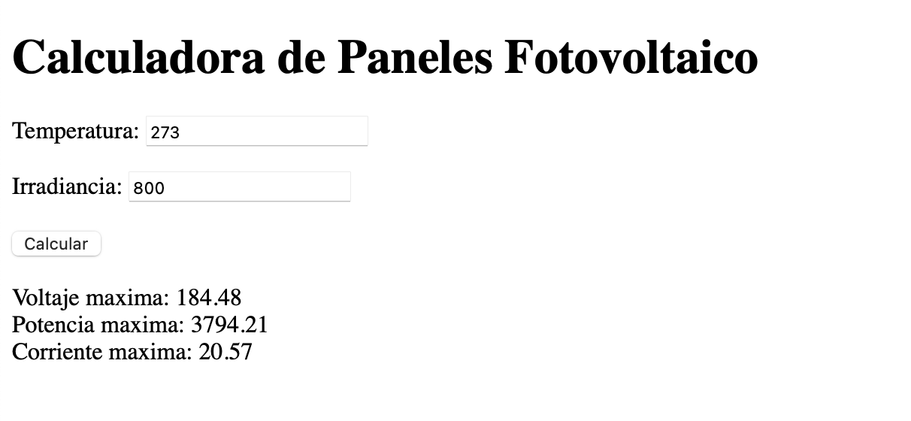

# Authors
- Paola Alejandra Martin
- Juan de Jesus Romero
- Andres Felipe Gomez

# Solar Panel Calculator

This is a simple web application for calculating solar panel characteristics based on input values of temperature and irradiance.

## Getting Started

### Prerequisites

- [Python](https://www.python.org/) (version 3.6 or higher)

### Installation

1. Clone the repository:

   ```bash
   git clone https://github.com/your-username/solar-panel-calculator.git
   ```
2. Navigate to the project directory:
```bash
cd solar-panel-calculator
```
3. Install the required python packages
```bash
pip install -r requirements.txt
```
### Usage
1. Run the Flask application:
```bash
python app.py
```
2. Open your web browser and go to http://127.0.0.1:8080/.

3. Enter the temperature and irradiance values, then click the "Calcular" button.

4. The UI will be updated to display the calculated maximum voltage, maximum power, and maximum.

This is an example of what you'll see in your browser


